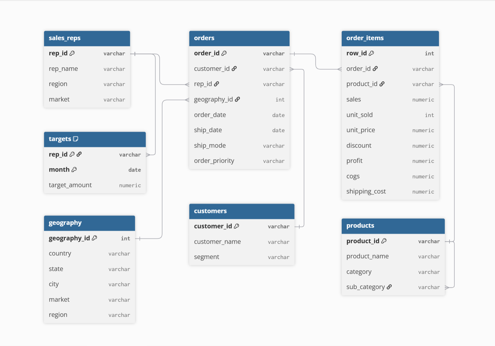

# Global Superstore Sales Analytics

## Overview
End-to-end sales analytics project using the Global Superstore dataset (51,290 order
line items across 7 markets). Raw transaction data was normalized into a relational
schema in PostgreSQL, enriched with sales rep and monthly target data, analyzed with
SQL, and visualized in a Power BI dashboard covering quota attainment, regional
performance, and category profitability.

## Dataset
Global Superstore dataset (51,290 order line items, 2011-2014).
Sales rep assignments and monthly targets were synthesized for this project, since
the source data doesn't include them — 36 reps were assigned per Market+Region
territory, and each rep's monthly target was set at 1.1x their own average monthly sales.

## Schema

## Key Insights
- Revenue grew from $2.26M in 2011 to $4.30M in 2014, with November and December consistently the strongest months and January/February the weakest
- APAC is the largest market by revenue ($3.59M, 12.2% margin), while Canada is the smallest by volume but the most efficient at a 26.6% margin
- Emerson Adler (EU - Central) is the top revenue-generating rep company-wide, at $870,982 in total sales
- Technology is the leading revenue category, growing from $827,652 (2011) to $1,616,159 (2014); Office Supplies' YoY growth accelerated to 29.2% by 2014
- Discounts over 20% flip average profit negative (-$72.13 per line item), compared to +$62.05 for undiscounted items — a clear case for tighter discount limits
- Quota attainment varied widely across the 36 reps, from under 50% to several multiples of target — a byproduct of both real performance variance and the synthetic target methodology (see Dataset note above)

## Dashboard

## Tools Used
PostgreSQL (staging + normalization, CTEs, window functions, views), Power BI

## How to reproduce
1. Load the source dataset and run `sql/schema.sql` to create all tables
2. Run `sql/normalize_data.sql` to populate normalized tables from staging
3. Run `sql/queries.sql` for the analysis
